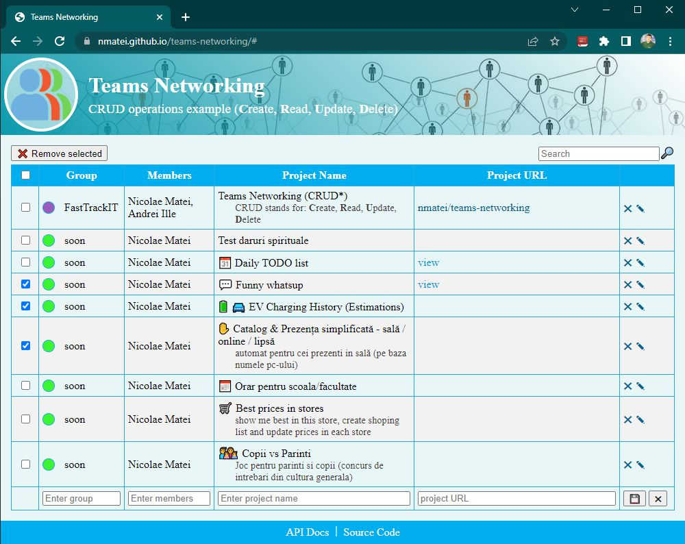

# Teams Networking

Teams job related networking (members, project name, project url)

In Current Demo you'll see some of projects created by my students.
You can also find new project ideas.

## 💠 Features & Usage

- [x] Teams Networking (CRUD\*) Operations
  - [x] **C**reate
  - [x] **R**ead
  - [x] **U**pdate
  - [x] **D**elete
- [x] Search
- [x] Loading mask

## 🎞 Live Preview

- ➡ [Projects & Ideas](https://nmatei.github.io/teams-networking/)

## 📋 Steps to create this project

- [x] create **New repository** in [github/new](https://github.com/new)
  - [x] check Add a **README** file
  - [x] Add **.gitignore** (Node template)
- [x] **clone** it on your pc
- [x] create **index.html** file with standards
- [x] create **table** that represents final desing and structure (2 persons as example)
  - [x] Table headers -> [firstName, lastName, links {github, linkedin} ]
  - [x] remove 2 example persons and load them from js
  - [x] hint - TABLE -> THEAD & TBODY & TFOOT tags
- [ ] load team.json and render them in page

## 🧩 Connect with API

Current app can connect with external [node-API](https://github.com/nmatei/node-api) to store it's data.

**Steps**

- [x] Clone & Start node-api
- [x] From current UI make request to node-api (using json or mysql url)
